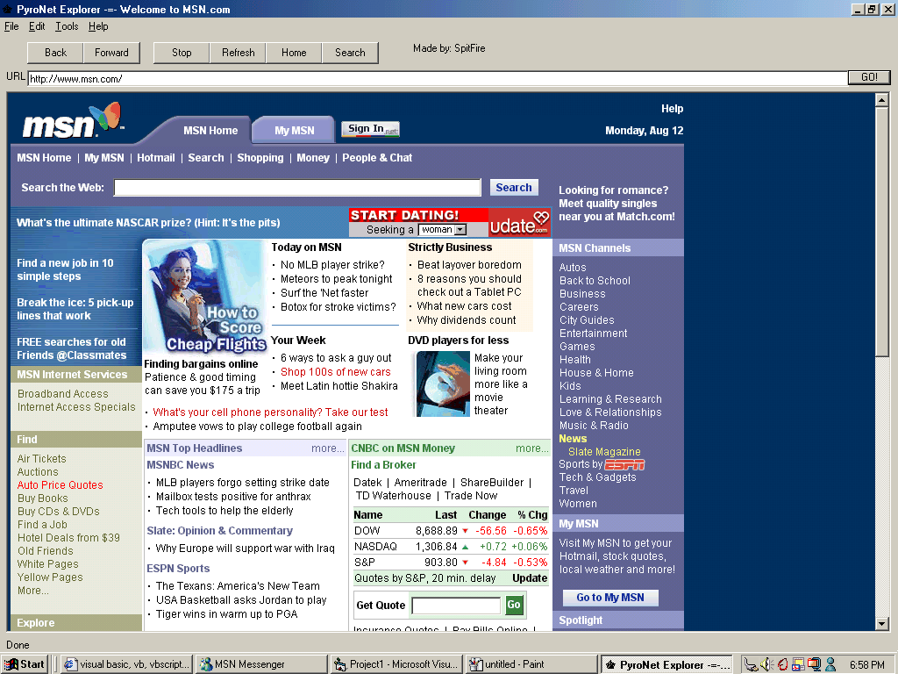



## PyroNet Explorer \(WebBrowser\)

### Description

This is my first browser with a status bar. It took me awhile to figure out how to get the Status Bar text to show up on a label. And then it just has your basic functions. PLEASE RATE IT!!
 
### More Info
 
Web Pages

Im pretty sure it only displays right with 1024x768 screen resolution! I havnt tested it on any others... If it does display right, e-mail me and tell me please

             |
---                |---
**Submitted On**   |2002-08-12 19:02:40
**By**             |[Jesse Seidel \(Dr\. Fire\)](https://github.com/Planet-Source-Code/PSCIndex/blob/master/ByAuthor/jesse-seidel-dr-fire.md)
**Level**          |Intermediate
**User Rating**    |3.2 (16 globes from 5 users)
**Compatibility**  |VB 6\.0
**Category**       |[Internet/ HTML](https://github.com/Planet-Source-Code/PSCIndex/blob/master/ByCategory/internet-html__1-34.md)
**World**          |[Visual Basic](https://github.com/Planet-Source-Code/PSCIndex/blob/master/ByWorld/visual-basic.md)
**Archive File**   |[PyroNet\_Ex1173468122002\.zip](https://github.com/Planet-Source-Code/jesse-seidel-dr-fire-pyronet-explorer-webbrowser__1-37892/archive/master.zip)

